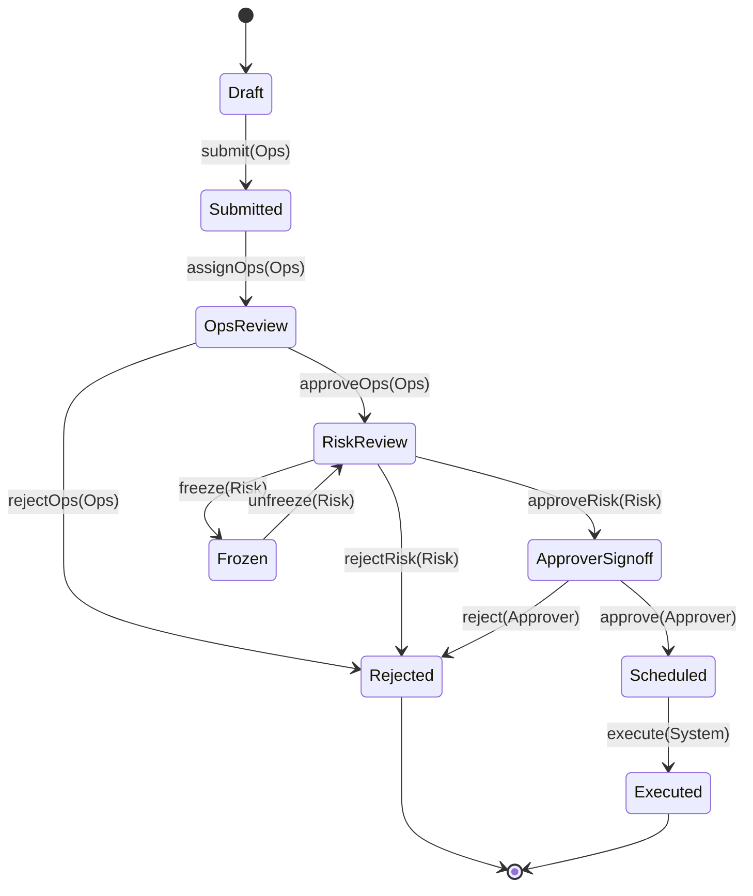
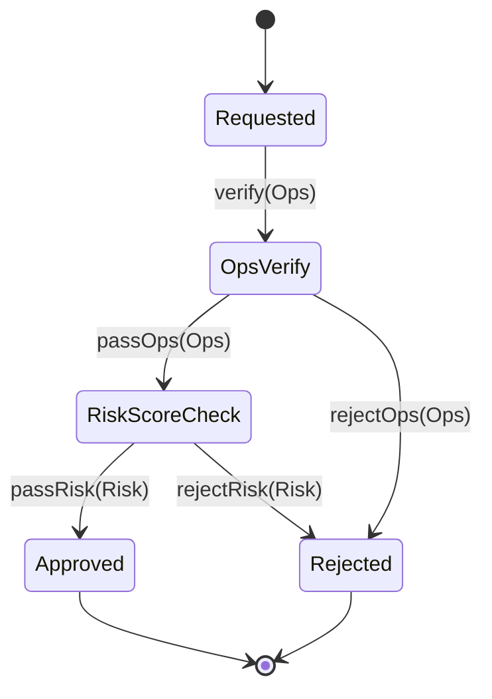
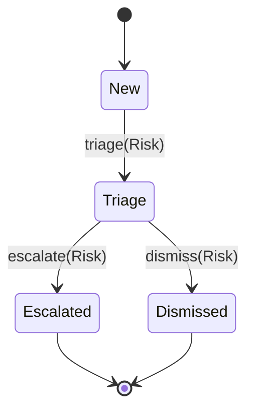
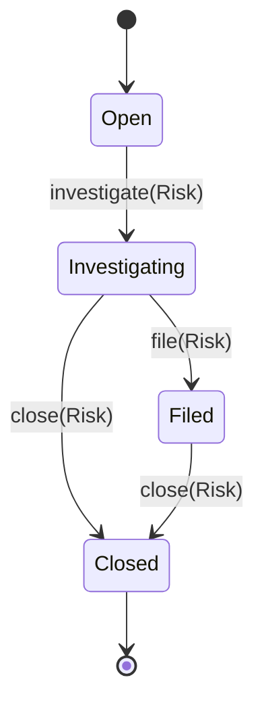

# 狀態機定義 (State Machines)

> 所有狀態轉換以**純函式**實作，每次 transition 產生 `AuditEvent`。
> 源碼位置：`packages/shared/src/state-machines/`

---

## 1. TransferRequest 出庫申請

### 狀態流程圖


### 轉換表
| 目前狀態 | 動作 | 角色 | 下一狀態 | 條件 |
|---------|------|------|---------|------|
| Draft | submit | Ops | Submitted | — |
| Submitted | assignOps | Ops | OpsReview | — |
| OpsReview | approveOps | Ops | RiskReview | riskScore > threshold 時強制進入 |
| OpsReview | rejectOps | Ops | Rejected | 需填寫理由 |
| RiskReview | approveRisk | Risk | ApproverSignoff | — |
| RiskReview | rejectRisk | Risk | Rejected | 需填寫理由 |
| RiskReview | freeze | Risk | Frozen | 需填寫凍結理由 |
| ApproverSignoff | approve | Approver | Scheduled | 進入冷卻期 |
| ApproverSignoff | reject | Approver | Rejected | 需填寫理由 |
| Scheduled | execute | System | Executed | 冷卻期結束後自動執行 |
| Frozen | unfreeze | Risk | RiskReview | 需填寫解凍理由 |

### 函式簽名
```typescript
type TransferState = "Draft" | "Submitted" | "OpsReview" | "RiskReview"
  | "ApproverSignoff" | "Scheduled" | "Executed" | "Rejected" | "Frozen";

type TransferAction = "submit" | "assignOps" | "approveOps" | "rejectOps"
  | "approveRisk" | "rejectRisk" | "freeze" | "approve" | "reject"
  | "execute" | "unfreeze";

function transferTransition(
  currentState: TransferState,
  action: TransferAction,
  actorRole: Role,
  context?: { riskScore?: number; reason?: string }
): TransitionResult<TransferState>;
```

---

## 2. WhitelistAddressRequest 白名單地址

### 狀態流程圖


### 轉換表
| 目前狀態 | 動作 | 角色 | 下一狀態 |
|---------|------|------|---------|
| Requested | verify | Ops | OpsVerify |
| OpsVerify | passOps | Ops | RiskScoreCheck |
| OpsVerify | rejectOps | Ops | Rejected |
| RiskScoreCheck | passRisk | Risk | Approved |
| RiskScoreCheck | rejectRisk | Risk | Rejected |

### 業務規則
- Approved 後才可在出庫申請中選取
- 未核准地址一律不可出庫
- 新核准地址進入冷卻期（Portal 設定）

---

## 3. Alert 警示

### 狀態流程圖


### 轉換表
| 目前狀態 | 動作 | 角色 | 下一狀態 | 說明 |
|---------|------|------|---------|------|
| New | triage | Risk | Triage | 初步評估 |
| Triage | dismiss | Risk | Dismissed | 需填寫理由 |
| Triage | escalate | Risk | Escalated | 自動建立 Case |

---

## 4. Case 案件

### 狀態流程圖


### 轉換表
| 目前狀態 | 動作 | 角色 | 下一狀態 | 說明 |
|---------|------|------|---------|------|
| Open | investigate | Risk | Investigating | 開始調查 |
| Investigating | file | Risk | Filed | STR/內控通報 |
| Investigating | close | Risk | Closed | 無需通報 |
| Filed | close | Risk | Closed | 通報完成後結案 |

---

## 5. AuditEvent 結構

```typescript
interface AuditEvent {
  id: string;
  timestamp: string;           // ISO 8601
  eventType: AuditEventType;   // e.g. "TRANSFER_SUBMITTED"
  actor: {
    userId: string;
    role: Role;
    displayName: string;
  };
  entity: {
    type: "TransferRequest" | "WhitelistAddressRequest" | "Alert" | "Case";
    id: string;
  };
  before: Record<string, unknown> | null;
  after: Record<string, unknown> | null;
  reason?: string;
  metadata?: Record<string, unknown>;
}

type AuditEventType =
  | "TRANSFER_SUBMITTED" | "TRANSFER_APPROVED" | "TRANSFER_REJECTED"
  | "TRANSFER_FROZEN" | "TRANSFER_UNFROZEN" | "TRANSFER_EXECUTED"
  | "WHITELIST_REQUESTED" | "WHITELIST_APPROVED" | "WHITELIST_REJECTED"
  | "ALERT_TRIAGED" | "ALERT_DISMISSED" | "ALERT_ESCALATED"
  | "CASE_OPENED" | "CASE_FILED" | "CASE_CLOSED"
  | "PII_UNMASKED" | "REPORT_EXPORTED";
```
